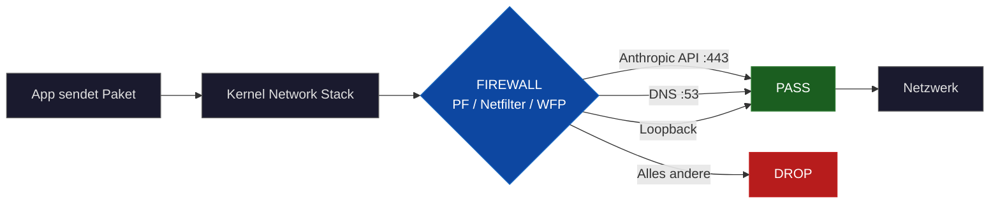
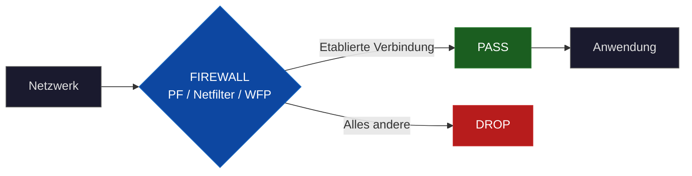

<p align="center">
  
</p>

<h1 align="center">Network Lockdown</h1>

<p align="center">
  <strong>Kernel-level emergency network isolation with AI-assisted incident response</strong>
</p>

<p align="center">
  <a href="README.md">
    
  </a>
  &nbsp;
  
</p>

<p align="center">
  <a href="https://github.com/pepperonas/network-lockdown/actions/workflows/ci.yml"></a>
  <a href="LICENSE"></a>
  
  
  
  
  
  <a href="https://github.com/pepperonas/network-lockdown/stargazers"></a>
</p>

---

## Overview

Emergency network lockdown for macOS, Linux and Windows. During a security incident, all network traffic is blocked at kernel level — **with one exception: Claude Code CLI stays online**. This allows you to isolate the machine while still using AI assistance (Claude Opus 4.6) for forensic analysis, malware identification and system remediation.

When lockdown is active, the following is allowed:

- Claude Code CLI connections to the Anthropic API (api.anthropic.com, Port 443 TLS)
- Localhost/loopback traffic
- DNS queries (necessary for IP resolution)
- Return packets from established connections

Everything else is blocked — browsers, SSH, updates, C2 callbacks, reverse shells, data exfiltration.

## Use Case: AI-Assisted Incident Response

### The Problem

During a security incident, the first rule is: **immediately disconnect the machine from the network** to prevent further damage. No data exfiltration, no lateral movement, no command-and-control communication.

But then you're left with an isolated machine and have to figure out what happened on your own. Forensic analysis, malware identification, log evaluation, finding backdoors, safely removing compromised files — all under time pressure and without help.

### The Solution

These scripts take the machine off the network, but leave **a single connection open: Claude Code CLI** to the Anthropic API.

Claude Code (recommended: Opus 4.6) is a full-featured AI agent in the terminal. It can read, create, search, analyze and edit files. This gives you an AI-powered incident response assistant directly on the affected system after lockdown:

**1. Network Isolation (Activate Lockdown)**
```bash
sudo ./network-lockdown.sh on
```
From now on, no process can communicate externally — no data exfiltration, no C2 callback, no exfiltration. Only Claude Code CLI stays online.

**2. Forensic Analysis with Claude Code**
```
> "Search /var/log for suspicious SSH logins in the last 48 hours"
> "Find all recently modified files in /etc and /usr/local/bin"
> "Analyze this binary for known malware patterns"
> "Show all active cronjobs and systemd timers — are there unknown entries?"
> "Check all open ports and their associated processes"
```

**3. Identify and Remove Malware**
```
> "This file looks like a reverse shell — analyze the code"
> "Find all files created by this user in the last 24 hours"
> "Secure-erase the compromised files with shred"
> "Check if authorized_keys has been tampered with"
```

**4. Harden System and Disable Lockdown**
```
> "Create a script that documents all found IOCs (Indicators of Compromise)"
> "Reset SSH configuration to secure defaults"
```
```bash
sudo ./network-lockdown.sh off
```

### Why This Works

- **Complete network isolation** at kernel level — no process can bypass it
- **Claude Code CLI only needs HTTPS to api.anthropic.com** — a single, encrypted connection
- **Claude Opus 4.6 analyzes any files**, logs, binaries and configurations directly in the terminal
- **No second machine needed** — the AI runs remotely at Anthropic, you only need the terminal
- **Attackers lose all connections** — C2 servers, exfiltration channels, reverse shells are immediately cut off

The result: You have a forensically isolated machine with an AI expert at your side.

> **Detailed Step-by-Step Guide:** See [INCIDENT-RESPONSE-GUIDE.en.md](INCIDENT-RESPONSE-GUIDE.en.md) — 11-phase guideline with specific Claude Code prompts for forensic analysis, malware removal and system hardening.

---

## How It Works: Kernel-Level Filtering

**Important:** All three scripts operate at **kernel level**.

Packet filtering is not performed in userspace, but directly in the operating system kernel, before packets reach the network interface or are forwarded to applications.

### Architecture Overview

**Outbound Traffic:**



**Inbound Traffic:**



### Packet Flow in Detail

1. **Application sends packet** (e.g. browser calls google.com)
2. **System call** passes packet to kernel
3. **Kernel network stack** receives packet
4. **Firewall filter** (PF/Netfilter/WFP) intercepts the packet
5. **Rule evaluation:**
   - Destination = Anthropic API IPs + Port 443? → **PASS**
   - Destination = DNS server + Port 53? → **PASS**
   - Destination = 127.0.0.1 / ::1? → **PASS**
   - Otherwise → **DROP** (without ICMP response)
6. Allowed packets reach the network interface

**Result:** Blocked packets are never sent. The application receives a timeout.

## Platform-Specific Implementation

### macOS: `network-lockdown.sh`

**Technology:** Packet Filter (PF)

- **Kernel framework:** PF is ported from OpenBSD and integrated into the XNU kernel
- **Kernel level:** Yes, PF is a kernel module that operates directly in the network stack
- **Userspace tool:** `pfctl` configures the kernel rules
- **Rule location:** `/etc/pf.anchors/claude-lockdown`
- **Backup mechanism:** `pfctl -sr` saves current rules, restoration via `/etc/pf.conf.bak`
- **Prerequisites:** None (pfctl is integrated in macOS)

**Specifics:**
- Uses PF anchors for clean rule isolation
- Automatic detection of dual-stack (IPv4/IPv6)
- Requires sudo privileges

### Linux: `network-lockdown-linux.sh`

**Technology:** iptables/ip6tables + Netfilter

- **Kernel framework:** Netfilter is built into the Linux kernel
- **Kernel level:** Yes, Netfilter uses kernel hooks at 5 points:
  - `NF_INET_PRE_ROUTING` (before routing decision)
  - `NF_INET_LOCAL_IN` (to local application)
  - `NF_INET_FORWARD` (forwarding)
  - `NF_INET_LOCAL_OUT` (from local application)
  - `NF_INET_POST_ROUTING` (after routing decision)
- **Userspace tools:** `iptables`, `ip6tables` configure Netfilter
- **Connection tracking:** `conntrack` kernel module for stateful filtering
- **Backup mechanism:** `iptables-save` / `iptables-restore`
- **DNS detection:** `resolvectl` or fallback to `/etc/resolv.conf`

**Specifics:**
- ICMPv6 explicitly allowed (for IPv6 Neighbor Discovery Protocol)
- Separate IPv4/IPv6 rule sets
- Requires root privileges

**Prerequisites:**
```bash
# Debian/Ubuntu
sudo apt-get install iptables dnsutils curl

# RHEL/CentOS/Fedora
sudo dnf install iptables bind-utils curl
```

### Windows: `network-lockdown-windows.ps1`

**Technology:** Windows Filtering Platform (WFP)

- **Kernel framework:** WFP is implemented in `netio.sys` (kernel-mode driver)
- **Kernel level:** Yes, WFP operates in the NDIS/TDI layers of the network stack
- **Userspace tools:** PowerShell `New-NetFirewallRule`, `netsh advfirewall`
- **Rule identification:** Prefix "Claude-Lockdown-" for all rules
- **Backup mechanism:** `netsh advfirewall export` (native .wfw format)
- **DNS resolution:** PowerShell `Resolve-DnsName` cmdlet

**Specifics:**
- Uses Windows Firewall API
- Separate rules for IPv4/IPv6
- Automatic profile detection (Domain/Private/Public)
- Requires administrator privileges

**Prerequisites:**
- PowerShell 5.1 or higher
- Windows 10/11 or Windows Server 2016+

## Usage

### macOS and Linux

```bash
# Activate lockdown
sudo ./network-lockdown.sh on

# Check status
sudo ./network-lockdown.sh status

# Update IP list (if Anthropic CDN changes)
sudo ./network-lockdown.sh refresh

# Display current rules
sudo ./network-lockdown.sh rules

# Deactivate lockdown
sudo ./network-lockdown.sh off

# Show help
./network-lockdown.sh help
```

### Windows

```powershell
# Open PowerShell as Administrator

# Activate lockdown
.\network-lockdown-windows.ps1 on

# Check status
.\network-lockdown-windows.ps1 status

# Update IP list
.\network-lockdown-windows.ps1 refresh

# Display current rules
.\network-lockdown-windows.ps1 rules

# Deactivate lockdown
.\network-lockdown-windows.ps1 off

# Show help
.\network-lockdown-windows.ps1 help
```

## Command Reference

| Command | Description |
|---------|-------------|
| `on` | Activates lockdown, creates backup of current firewall rules |
| `off` | Deactivates lockdown, restores previous rules |
| `status` | Shows current status (active/inactive) and last activation |
| `refresh` | Updates Anthropic IP addresses, automatically reactivates lockdown |
| `rules` | Shows all active lockdown rules in detail |
| `help` | Shows usage instructions |

## Allowed Network Traffic

### Always Allowed

- **Loopback:** 127.0.0.0/8, ::1/128
- **DNS:** Port 53 (TCP/UDP) to system DNS servers
- **Established connections:** Return packets from already established connections
- **ICMPv6** (Linux only): Neighbor Discovery Protocol

### Only to Anthropic API

- **Protocol:** HTTPS (TCP Port 443)
- **Destination:** All IP addresses that `api.anthropic.com` resolves to
- **Direction:** Outbound only

### Everything Else

**Blocked** (without response to sender)

## Security Considerations

### IP Resolution at Activation Time

The Anthropic API IPs are resolved via DNS when running `on` or `refresh`:

```bash
# macOS/Linux
dig +short api.anthropic.com A
dig +short api.anthropic.com AAAA

# Windows
Resolve-DnsName api.anthropic.com
```

**Important:** If Anthropic changes its CDN IPs, `refresh` must be executed.

### DNS as Attack Surface

DNS traffic is allowed because it is necessary for IP resolution. This is a minimal attack surface:

- DNS spoofing could theoretically deliver false IPs
- **Mitigation:** Claude Code CLI uses TLS certificate verification
- Only `api.anthropic.com` is resolved, not arbitrary domains

### Lockfile Protection

- Prevents accidental double activation
- Location: `/tmp/claude-lockdown.lock` (macOS/Linux)
- Automatically removed on `off`

### Backup and Restore

**macOS:**
```bash
# Backup
pfctl -sr > /etc/pf.conf.bak

# Restore
pfctl -f /etc/pf.conf.bak
```

**Linux:**
```bash
# Backup
iptables-save > /etc/iptables.backup
ip6tables-save > /etc/ip6tables.backup

# Restore
iptables-restore < /etc/iptables.backup
ip6tables-restore < /etc/ip6tables.backup
```

**Windows:**
```powershell
# Backup
netsh advfirewall export "C:\Windows\Temp\firewall-backup.wfw"

# Restore
netsh advfirewall import "C:\Windows\Temp\firewall-backup.wfw"
```

### Permissions

All scripts require elevated privileges:

- **macOS/Linux:** `sudo` (root)
- **Windows:** Administrator (elevated PowerShell)

**Reason:** Firewall configuration is a privileged operation because it modifies kernel security mechanisms.

## Technical Details: Kernel Hooks

### macOS (PF)

PF integrates into the XNU Kernel Network Stack:

```
Application → BSD Socket Layer → Network Layer (PF Hook) → Link Layer → Hardware
```

PF rules are stored in kernel memory and configured by `pfctl` via ioctl() system calls.

### Linux (Netfilter)

Netfilter hooks in the kernel network pipeline:

```
Packet arrives → PRE_ROUTING → routing decision → FORWARD / LOCAL_IN
Packet sent → LOCAL_OUT → routing decision → POST_ROUTING → Network Interface
```

Each hook position can ACCEPT, DROP or REJECT packets.

### Windows (WFP)

WFP layering in the Windows Network Stack:

```
Application → Winsock → AFD.sys → TCP/IP Stack → WFP Callout Drivers → NDIS → NIC Driver
```

WFP filters are registered as kernel-mode objects and evaluated by the Filter Engine.

## Troubleshooting

### "Already active" on startup

**Cause:** Lockfile still exists
```bash
# macOS/Linux
sudo rm /tmp/claude-lockdown.lock
sudo ./network-lockdown.sh on
```

### "Permission denied"

**Cause:** Missing admin privileges
```bash
# Always run with sudo/Administrator
sudo ./network-lockdown.sh on
```

### Claude Code CLI cannot connect

1. Check status: `sudo ./network-lockdown.sh status`
2. Update IPs: `sudo ./network-lockdown.sh refresh`
3. Check rules: `sudo ./network-lockdown.sh rules`
4. If problems persist: Deactivate lockdown and test manually

### DNS resolution fails

**Linux:** Check if `dig` is installed
```bash
sudo apt-get install dnsutils
```

**Windows:** Check if DNS Client Service is running
```powershell
Get-Service Dnscache | Start-Service
```

## Performance Notes

- **Overhead:** Kernel-level filtering has minimal performance impact (<1% CPU)
- **Latency:** No measurable latency for allowed connections
- **Memory:** Rules occupy ~4-8 KB of kernel memory
- **Scaling:** Up to 50 IP addresses are easily manageable

## Color Scheme

All scripts use a consistent color scheme, optimized for dark terminals:

| Color | ANSI Code (Bash) | PowerShell | Usage |
|-------|------------------|------------|-------|
| **Red** | `\033[1;31m` | `Red` | Errors, Blocked, Critical |
| **Green** | `\033[1;32m` | `Green` | Success, Allowed, OK |
| **Yellow** | `\033[1;33m` | `Yellow` | Warnings, Caution |
| **Cyan** | `\033[0;96m` | `Cyan` | Info, Progress, Instructions |
| **Magenta** | `\033[0;95m` | `Magenta` | Section headers, Banner frames, Accents |
| **White** | `\033[1;37m` | `White` | Titles, Primary labels |
| **Gray** | `\033[0;90m` | `DarkGray` | Secondary (Version, Attribution, Details) |

**Design Principles:**
- Bright variants (`1;3xm` / `0;9xm`) for maximum readability on dark backgrounds
- Clear semantic separation: Yellow = warnings only, Magenta = structure/headers only
- Consistent across all three platforms (macOS, Linux, Windows)

## License and Liability

These scripts are provided without warranty. Test them in a safe environment before using them in production.

**Warning:** An active lockdown blocks all network connections except Claude Code CLI. SSH connections, updates, browsers etc. will not work.

---

<p align="center">
  🔐 Forged behind locked doors in Berlin by <a href="https://github.com/pepperonas">Martin Pfeffer</a>
</p>
