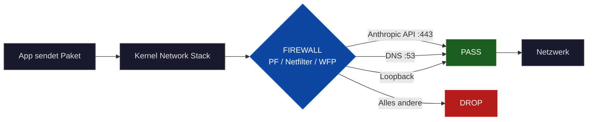
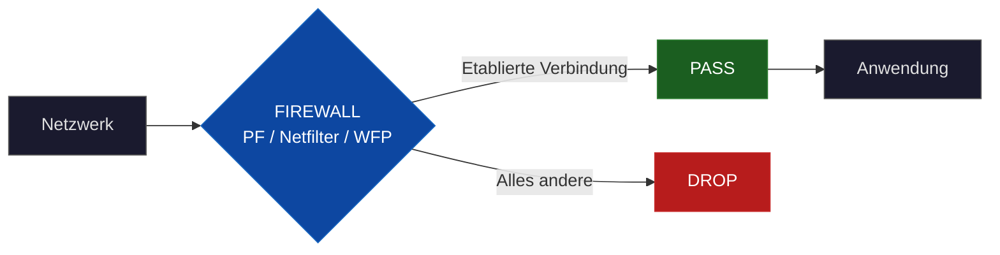

<p align="center">
  
</p>

<h1 align="center">Network Lockdown</h1>

<p align="center">
  <strong>Kernel-level emergency network isolation with AI-assisted incident response</strong>
</p>

<p align="center">
  
  &nbsp;
  <a href="README.en.md">
    
  </a>
</p>

<p align="center">
  <a href="https://github.com/pepperonas/network-lockdown/actions/workflows/ci.yml"></a>
  <a href="LICENSE"></a>
  
  
  
  
  
</p>

<p align="center">
  <a href="https://github.com/pepperonas/network-lockdown/stargazers"></a>
  <a href="https://github.com/pepperonas/network-lockdown/network/members"></a>
  <a href="https://github.com/pepperonas/network-lockdown/issues"></a>
  <a href="https://github.com/pepperonas/network-lockdown/pulls"></a>
  
  
</p>

<p align="center">
  
  
  
  
  
</p>

<p align="center">
  <a href="https://www.paypal.com/donate/?business=martinpaush@gmail.com&currency_code=EUR">
    
  </a>
</p>

---

## Übersicht

Notfall-Netzwerk-Lockdown für macOS, Linux und Windows. Bei einem Sicherheitsvorfall wird der gesamte Netzwerkverkehr auf Kernel-Ebene blockiert — **mit einer Ausnahme: Claude Code CLI bleibt online**. Damit kannst du den Rechner isolieren und trotzdem mit KI-Unterstützung (Claude Opus 4.6) forensische Analyse betreiben, Schadcode identifizieren und das System bereinigen.

Im aktivierten Zustand ist erlaubt:

- Claude Code CLI-Verbindungen zur Anthropic API (`api.anthropic.com` und `api.statsig.com`, Port 443 TLS)
- Localhost/Loopback-Verkehr
- DNS-Anfragen (notwendig für IP-Auflösung)
- Rückpakete etablierter Verbindungen

Alles andere wird blockiert — Browser, SSH, Updates, C2-Callbacks, Reverse Shells, Datenexfiltration.

## Use Case: Incident Response mit KI-Unterstützung

### Das Problem

Bei einem Sicherheitsvorfall lautet die erste Regel: **den Rechner sofort vom Netz nehmen**, um weiteren Schaden zu verhindern. Kein Datenabfluss, keine Lateral Movement, keine Command-and-Control-Kommunikation.

Aber dann stehst du vor einem isolierten Rechner und musst alleine herausfinden, was passiert ist. Forensische Analyse, Schadcode identifizieren, Logs auswerten, Backdoors finden, kompromittierte Dateien sicher löschen — das alles unter Zeitdruck und ohne Hilfe.

### Die Lösung

Diese Skripte nehmen den Rechner vom Netz, lassen aber **eine einzige Verbindung offen: Claude Code CLI** zur Anthropic API.

Claude Code (empfohlen: Opus 4.6) ist ein vollwertiger KI-Agent im Terminal. Er kann Dateien lesen, erstellen, durchsuchen, analysieren und bearbeiten. Damit hast du nach dem Lockdown einen KI-gestützten Incident-Response-Assistenten direkt auf dem betroffenen System:

**1. Netzwerkisolation (Lockdown aktivieren)**
```bash
sudo ./network-lockdown.sh on
```
Ab jetzt kann kein Prozess mehr nach außen kommunizieren — kein Datenabfluss, kein C2-Callback, keine Exfiltration. Nur Claude Code CLI bleibt online.

**2. Forensische Analyse mit Claude Code**
```
> "Durchsuche /var/log auf verdächtige SSH-Logins der letzten 48 Stunden"
> "Finde alle kürzlich geänderten Dateien in /etc und /usr/local/bin"
> "Analysiere diese Binary auf bekannte Malware-Patterns"
> "Zeige alle aktiven Cronjobs und systemd Timer — gibt es unbekannte Einträge?"
> "Prüfe alle offenen Ports und die zugehörigen Prozesse"
```

**3. Schadcode identifizieren und beseitigen**
```
> "Diese Datei sieht nach einer Reverse Shell aus — analysiere den Code"
> "Finde alle Dateien die von diesem User in den letzten 24h erstellt wurden"
> "Secure-erase der kompromittierten Dateien mit shred"
> "Prüfe ob authorized_keys manipuliert wurde"
```

**4. System härten und Lockdown aufheben**
```
> "Erstelle ein Skript das alle gefundenen IOCs (Indicators of Compromise) dokumentiert"
> "Setze die SSH-Konfiguration auf sichere Defaults zurück"
```
```bash
sudo ./network-lockdown.sh off
```

### Warum das funktioniert

- **Vollständige Netzwerkisolation** auf Kernel-Ebene — kein Prozess kann das umgehen
- **Claude Code CLI braucht nur HTTPS zu Anthropic** — zwei eng begrenzte, verschlüsselte Endpoints (API + Telemetry)
- **Claude Opus 4.6 analysiert beliebige Dateien**, Logs, Binaries und Konfigurationen direkt im Terminal
- **Kein zweiter Rechner nötig** — die KI läuft remote bei Anthropic, du brauchst nur das Terminal
- **Angreifer verlieren jede Verbindung** — C2-Server, Exfiltrations-Kanäle, Reverse Shells werden sofort gekappt

Das Ergebnis: Du hast einen forensisch isolierten Rechner mit einem KI-Experten an deiner Seite.

> **Ausführliche Schritt-für-Schritt-Anleitung:** Siehe [INCIDENT-RESPONSE-GUIDE.md](INCIDENT-RESPONSE-GUIDE.md) — 11-Phasen-Guideline mit konkreten Claude-Code-Prompts für forensische Analyse, Schadcode-Beseitigung und System-Härtung.

---

## Funktionsweise: Kernel-Level Filtering

**Wichtig:** Alle drei Skripte arbeiten auf **Kernel-Ebene**.

Die Paketfilterung erfolgt nicht im Userspace, sondern direkt im Betriebssystem-Kernel, bevor Pakete das Netzwerk-Interface erreichen oder an Anwendungen weitergeleitet werden.

### Architektur-Überblick

**Ausgehender Traffic:**


```mermaid
graph LR
    A["App sendet Paket"]:::node --> B["Kernel Network Stack"]:::node
    B --> D{"FIREWALL<br/>PF / Netfilter / WFP"}:::fw
    D -- "Anthropic API :443" --> PASS["PASS"]:::pass
    D -- "DNS :53" --> PASS
    D -- "Loopback" --> PASS
    D -- "Alles andere" --> DROP["DROP"]:::drop
    PASS --> NET["Netzwerk"]:::node

    classDef node fill:#1a1a2e,stroke:#555,color:#e0e0e0
    classDef fw fill:#0d47a1,stroke:#1565c0,color:#ffffff
    classDef pass fill:#1b5e20,stroke:#2e7d32,color:#ffffff
    classDef drop fill:#b71c1c,stroke:#c62828,color:#ffffff
```

**Eingehender Traffic:**


```mermaid
graph LR
    NET["Netzwerk"]:::node --> J{"FIREWALL<br/>PF / Netfilter / WFP"}:::fw
    J -- "Etablierte Verbindung" --> PASS["PASS"]:::pass
    J -- "Alles andere" --> DROP["DROP"]:::drop
    PASS --> APP["Anwendung"]:::node

    classDef node fill:#1a1a2e,stroke:#555,color:#e0e0e0
    classDef fw fill:#0d47a1,stroke:#1565c0,color:#ffffff
    classDef pass fill:#1b5e20,stroke:#2e7d32,color:#ffffff
    classDef drop fill:#b71c1c,stroke:#c62828,color:#ffffff
```

### Paket-Flow im Detail

1. **Anwendung sendet Paket** (z.B. Browser ruft google.com auf)
2. **System Call** übergibt Paket an Kernel
3. **Kernel Network Stack** empfängt Paket
4. **Firewall-Filter** (PF/Netfilter/WFP) interceptiert das Paket
5. **Regelauswertung:**
   - Ziel = Anthropic API IPs + Port 443? → **PASS**
   - Ziel = DNS-Server + Port 53? → **PASS**
   - Ziel = 127.0.0.1 / ::1? → **PASS**
   - Sonst → **DROP** (ohne ICMP-Antwort)
6. Erlaubte Pakete erreichen das Network Interface

**Ergebnis:** Blockierte Pakete werden niemals gesendet. Die Anwendung erhält einen Timeout.

## Plattform-spezifische Implementierung

### macOS: `network-lockdown.sh`

**Technologie:** Packet Filter (PF)

- **Kernel-Framework:** PF ist von OpenBSD portiert und in den XNU-Kernel integriert
- **Kernel-Level:** Ja, PF ist ein Kernel-Modul, das direkt im Netzwerk-Stack arbeitet
- **Userspace-Tool:** `pfctl` konfiguriert die Kernel-Rules
- **Regel-Speicherort:** `/etc/pf.anchors/claude-lockdown`
- **Backup-Mechanismus:** `pfctl -sr` sichert aktuelle Rules, Wiederherstellung via `/etc/pf.conf.bak`
- **Voraussetzungen:** Keine (pfctl ist in macOS integriert)

**Besonderheiten:**
- Nutzt PF-Anchors für saubere Isolation der Rules
- Automatische Erkennung von Dual-Stack (IPv4/IPv6)
- Benötigt sudo-Rechte

### Linux: `network-lockdown-linux.sh`

**Technologie:** iptables/ip6tables + Netfilter

- **Kernel-Framework:** Netfilter ist fest im Linux-Kernel integriert
- **Kernel-Level:** Ja, Netfilter verwendet Kernel-Hooks an 5 Stellen:
  - `NF_INET_PRE_ROUTING` (vor Routing-Entscheidung)
  - `NF_INET_LOCAL_IN` (zu lokaler Anwendung)
  - `NF_INET_FORWARD` (Weiterleitung)
  - `NF_INET_LOCAL_OUT` (von lokaler Anwendung)
  - `NF_INET_POST_ROUTING` (nach Routing-Entscheidung)
- **Userspace-Tools:** `iptables`, `ip6tables` konfigurieren Netfilter
- **Connection Tracking:** `conntrack` Kernel-Modul für Stateful Filtering
- **Backup-Mechanismus:** `iptables-save` / `iptables-restore`
- **DNS-Erkennung:** `resolvectl` oder Fallback auf `/etc/resolv.conf`

**Besonderheiten:**
- ICMPv6 explizit erlaubt (für IPv6 Neighbor Discovery Protocol)
- Separate IPv4/IPv6-Regelsätze
- Benötigt root-Rechte

**Voraussetzungen:**
```bash
# Debian/Ubuntu
sudo apt-get install iptables dnsutils curl

# RHEL/CentOS/Fedora
sudo dnf install iptables bind-utils curl
```

### Windows: `network-lockdown-windows.ps1`

**Technologie:** Windows Filtering Platform (WFP)

- **Kernel-Framework:** WFP ist in `netio.sys` implementiert (Kernel-Mode-Treiber)
- **Kernel-Level:** Ja, WFP arbeitet in den NDIS/TDI-Schichten des Netzwerk-Stacks
- **Userspace-Tools:** PowerShell `New-NetFirewallRule`, `netsh advfirewall`
- **Regel-Identifikation:** Präfix "Claude-Lockdown-" für alle Rules
- **Backup-Mechanismus:** `netsh advfirewall export` (natives .wfw-Format)
- **DNS-Auflösung:** PowerShell `Resolve-DnsName` Cmdlet

**Besonderheiten:**
- Nutzt Windows Firewall API
- Separate Rules für IPv4/IPv6
- Automatische Profil-Erkennung (Domain/Private/Public)
- Benötigt Administrator-Rechte

**Voraussetzungen:**
- PowerShell 5.1 oder höher
- Windows 10/11 oder Windows Server 2016+

## Verwendung

### macOS und Linux

```bash
# Lockdown aktivieren
sudo ./network-lockdown.sh on

# Status prüfen
sudo ./network-lockdown.sh status

# IP-Liste aktualisieren (falls Anthropic CDN sich ändert)
sudo ./network-lockdown.sh refresh

# Aktuelle Rules anzeigen
sudo ./network-lockdown.sh rules

# Lockdown deaktivieren
sudo ./network-lockdown.sh off

# Incident-Response-Guide (PDF) herunterladen
./network-lockdown.sh guide

# Hilfe anzeigen
./network-lockdown.sh help
```

### Windows

```powershell
# PowerShell als Administrator öffnen

# Lockdown aktivieren
.\network-lockdown-windows.ps1 on

# Status prüfen
.\network-lockdown-windows.ps1 status

# IP-Liste aktualisieren
.\network-lockdown-windows.ps1 refresh

# Aktuelle Rules anzeigen
.\network-lockdown-windows.ps1 rules

# Lockdown deaktivieren
.\network-lockdown-windows.ps1 off

# Incident-Response-Guide (PDF) herunterladen
.\network-lockdown-windows.ps1 guide

# Hilfe anzeigen
.\network-lockdown-windows.ps1 help
```

## Befehls-Referenz

| Befehl | Beschreibung |
|--------|--------------|
| `on` | Aktiviert den Lockdown, erstellt Backup der aktuellen Firewall-Rules |
| `off` | Deaktiviert den Lockdown, stellt vorherige Rules wieder her |
| `status` | Zeigt aktuellen Status (aktiv/inaktiv) und letzte Aktivierung |
| `refresh` | Aktualisiert Anthropic IP-Adressen, reaktiviert Lockdown automatisch |
| `rules` | Zeigt alle aktiven Lockdown-Rules im Detail |
| `guide` | Lädt den Incident-Response-Guide als PDF herunter (DE + EN) |
| `help` | Zeigt Verwendungshinweise |

## Erlaubter Netzwerkverkehr

### Immer erlaubt

- **Loopback:** 127.0.0.0/8, ::1/128
- **DNS:** Port 53 (TCP/UDP) zu System-DNS-Servern
- **Established Connections:** Rückpakete bereits etablierter Verbindungen
- **ICMPv6** (nur Linux): Neighbor Discovery Protocol

### Nur zu Anthropic / Statsig

- **Protokoll:** HTTPS (TCP Port 443)
- **Ziele:** IPs von `api.anthropic.com` (dedizierte AS `AP-2440`, `160.79.104.0/21`) und `api.statsig.com` (Telemetry/Feature-Flags, Google Cloud LB)
- **Richtung:** Nur ausgehend (outbound)
- **Hinweis:** Der Statsig-Endpoint liegt auf einer geteilten Google-Cloud-IP — siehe "Geteilte Cloud-IPs als Restrisiko".

### Alles andere

**Blockiert** (ohne Antwort an Absender)

## Sicherheitsaspekte

### IP-Auflösung zur Aktivierungszeit

Die erlaubten IPs werden beim Ausführen von `on` oder `refresh` via DNS aufgelöst — für `api.anthropic.com` und `api.statsig.com`:

```bash
# macOS/Linux
dig +short api.anthropic.com A
dig +short api.anthropic.com AAAA
dig +short api.statsig.com A

# Windows
Resolve-DnsName api.anthropic.com
Resolve-DnsName api.statsig.com
```

**Wichtig:** Wenn Anthropic seine IPs ändert, muss `refresh` ausgeführt werden.

### DNS als Angriffsfläche

DNS-Verkehr ist erlaubt, da er für die IP-Auflösung notwendig ist. Dies ist eine minimale Angriffsfläche:

- DNS-Spoofing könnte theoretisch falsche IPs liefern
- **Mitigation:** Claude Code CLI verwendet TLS-Zertifikatsprüfung
- Nur die zwei genannten Domains werden aufgelöst — keine beliebigen Hosts

### Lockfile-Schutz

- Verhindert versehentliche Doppel-Aktivierung
- Speicherort: `/tmp/claude-lockdown.lock` (macOS/Linux)
- Wird bei `off` automatisch entfernt

### Backup und Wiederherstellung

**macOS:**
```bash
# Backup
pfctl -sr > /etc/pf.conf.bak

# Restore
pfctl -f /etc/pf.conf.bak
```

**Linux:**
```bash
# Backup
iptables-save > /etc/iptables.backup
ip6tables-save > /etc/ip6tables.backup

# Restore
iptables-restore < /etc/iptables.backup
ip6tables-restore < /etc/ip6tables.backup
```

**Windows:**
```powershell
# Backup
netsh advfirewall export "C:\Windows\Temp\firewall-backup.wfw"

# Restore
netsh advfirewall import "C:\Windows\Temp\firewall-backup.wfw"
```

### Berechtigungen

Alle Skripte benötigen erhöhte Rechte:

- **macOS/Linux:** `sudo` (root)
- **Windows:** Administrator (elevated PowerShell)

**Grund:** Firewall-Konfiguration ist eine privilegierte Operation, da sie die Kernel-Sicherheitsmechanismen modifiziert.

## Technische Details: Kernel-Hooks

### macOS (PF)

PF integriert sich in den XNU Kernel Network Stack:

```
Application → BSD Socket Layer → Network Layer (PF Hook) → Link Layer → Hardware
```

PF-Regeln werden in Kernel-Memory gespeichert und von `pfctl` via ioctl() Systemcalls konfiguriert.

### Linux (Netfilter)

Netfilter Hooks in der Kernel Network Pipeline:

```
Packet arrives → PRE_ROUTING → routing decision → FORWARD / LOCAL_IN
Packet sent → LOCAL_OUT → routing decision → POST_ROUTING → Network Interface
```

Jede Hook-Position kann Pakete ACCEPT, DROP oder REJECT.

### Windows (WFP)

WFP Layering im Windows Network Stack:

```
Application → Winsock → AFD.sys → TCP/IP Stack → WFP Callout Drivers → NDIS → NIC Driver
```

WFP Filter werden als Kernel-Mode-Objekte registriert und vom Filter Engine evaluiert.

## Fallstrick: Docker & WSL2 umgehen den Lockdown

Docker (und WSL2 auf Windows) können den Lockdown **ohne Gegenmaßnahmen umgehen**. Das ist kein Bug der Skripte, sondern Architektur: Container-Traffic läuft an den standardmäßigen Firewall-Hooks vorbei.

### Bypass-Risiko pro Plattform

| Plattform | Bypass-Risiko | Wodurch |
|-----------|---------------|---------|
| **Linux**   | hoch          | Laufender Docker-Daemon kann FORWARD-Regeln neu erstellen (INSERT vor DROP); Container kommunizieren via FORWARD, nicht OUTPUT |
| **macOS**   | gering        | PF arbeitet paket-basiert; `com.docker.backend` ist normaler Host-Prozess und wird gefiltert |
| **Windows** | sehr hoch     | WSL2/Hyper-V-VMs umgehen `NetFirewallRule` komplett; nur `NetFirewallHyperVRule` würde greifen — ältere Skript-Versionen nutzten sie nicht |

### Warum bypasst Docker die Firewall?

- **Linux:** Docker fügt seine iptables-Regeln per `-I` (INSERT) am Anfang der FORWARD-Chain ein. Selbst bei `FORWARD DROP` als Default-Policy kommen Pakete via Docker-Bridge (`docker0`) durch, weil Docker eigene ACCEPT-Regeln davor platziert. Ein Skript-`iptables -F` flusht zwar alles, aber sobald der Daemon einen Container (re-)konfiguriert, baut er die Regeln wieder auf — und der Lockdown ist umgangen.
- **Windows:** WSL2 und Docker Desktop laufen in Hyper-V-VMs mit eigenem virtuellem Netzwerk-Adapter. Pakete gehen am Windows-Network-Stack vorbei direkt durch den Hyper-V-Switch — `New-NetFirewallRule` sieht sie nie. Erst die seit Win 11 22H2 verfügbare **Hyper-V-Firewall** (`New-NetFirewallHyperVRule`) hookt sich tief genug ein.
- **macOS:** Docker Desktop läuft in einer Linux-VM via Virtualization.framework. Ausgehender Traffic landet bei `com.docker.backend` auf dem Host und geht über die normale NIC raus — PF sieht das Paket und filtert es korrekt.

### Lösung in den Skripten

Die Skripte erkennen Docker/WSL2 und ergänzen plattformspezifische Schutzmaßnahmen:

| Skript | Gegenmaßnahme |
|--------|---------------|
| `network-lockdown-linux.sh` (`block_docker_traffic`) | `iptables -I DOCKER-USER 1 -j DROP` + DROP in FORWARD für alle erkannten `docker0`/`br-*`-Bridges (IPv4+IPv6). |
| `network-lockdown-windows.ps1` (`Block-HyperVTraffic`) | Iteriert über alle aktiven VMCreatorIds, setzt `DefaultOutboundAction = Block` und legt `New-NetFirewallHyperVRule`-Allow-Regeln für Anthropic + DNS an. Erfordert Win 11 22H2+. |
| `network-lockdown-mac.sh` (`detect_docker`) | Nur Detection + Warnung — PF filtert Container-Traffic bereits auf Paket-Ebene. |

Für **vollständige Isolation** zusätzlich empfohlen:
```bash
# Linux
sudo systemctl stop docker docker.socket containerd

# Windows (PowerShell als Admin)
wsl --shutdown
Stop-Service -Name "com.docker.service" -Force

# macOS
osascript -e 'quit app "Docker Desktop"'
```

Auf älteren Windows-Versionen ohne Hyper-V-Firewall (< Win 11 22H2) gibt das Skript eine explizite rote Warnung aus, wenn WSL/Docker erkannt wird — dort hilft nur Stoppen.

### Weitere Fallstricke

Neben Docker decken die Skripte folgende Vektoren ab:

**Andere Container-Runtimes (Linux):** Podman, LXC/LXD, containerd direkt, Kubernetes (kind/k3s/minikube), libvirt — alle benutzen denselben iptables-Manipulations-Trick wie Docker. `block_container_traffic` erkennt sie über bekannte Bridge-Namen (`podman*`, `cni-*`, `lxcbr*`, `virbr*`, `flannel*`, `cilium*`, `kube-*`) plus eine Heuristik, die alle veth/bridge/tun-Interfaces außer Loopback und Default-Uplink blockiert. Plus DROP in `CNI-FORWARD`, `KUBE-FORWARD`, `LIBVIRT_FWO`.

**nftables direkt geschrieben (Linux):** Auf modernen Distros (Debian 11+, RHEL 9+, Fedora) ist nftables das Default-Backend. Tools wie firewalld, eBPF/Cilium können direkt in nft schreiben — `iptables-save` sieht das nicht und das Backup erfasst es nicht. `check_nftables` warnt, wenn solche Tabellen existieren.

**Bestehende Verbindungen — `--strict` Flag:** Standardmäßig stoppt der Lockdown nur **neue** Verbindungen; bereits offene TCP-Sessions (z.B. einer aktiven Malware-Verbindung) laufen via `ESTABLISHED`/`flags A/A` weiter. Mit `--strict` (bzw. `-Strict` auf Windows) werden sie zwangsweise geschlossen:
- Linux: `conntrack -F` + `ss --kill state established`
- macOS: `pfctl -F states`
- Windows: `iphlpapi.dll!SetTcpEntry` mit `MIB_TCP_STATE_DELETE_TCB` (gleiche Methode wie Sysinternals TCPView — killt Connections ohne Prozesse zu killen)

```bash
sudo ./network-lockdown-linux.sh on --strict
sudo ./network-lockdown-mac.sh on --strict
.\network-lockdown-windows.ps1 on -Strict
```

`--strict` ist auch **auf einem bereits aktiven Lockdown** anwendbar — das Skript erkennt den Zustand und führt nur den State-Flush durch, ohne die Regeln neu aufzubauen:

```bash
# Lockdown läuft seit 5 Minuten, jetzt nachträglich Verbindungen killen:
sudo ./network-lockdown-linux.sh on --strict
```

Beim `refresh` wird `--strict` automatisch ignoriert, sonst würde die laufende Anthropic-Session beim IP-Update gekillt.

**macOS Application Firewall (`socketfilterfw`):** Die GUI-Firewall in System Settings ist nicht PF, sondern sitzt höher im Stack. Wenn sie im Block-All-Modus läuft, blockiert sie eventuell Anthropic-Verkehr — kein Bypass, aber funktional verwirrend. `check_app_firewall` warnt.

**WSL Mirrored Networking (Windows 11):** Mit `networkingMode=mirrored` in `.wslconfig` teilt sich WSL2 den Host-Network-Stack statt eigenes vEthernet zu nutzen. Hyper-V-Firewall-Regeln greifen anders. `Get-WSLNetworkingMode` erkennt den Modus und gibt einen Hinweis.

**Race Condition behoben:** Default-Policy `DROP` wird **vor** dem Flush gesetzt (Linux), macOS nutzt atomares `pfctl -f` ohne separaten Flush. Schließt das millisekundenkurze Fenster zwischen Regel-Flush und neuer Policy.

### Geteilte Cloud-IPs als Restrisiko

`api.statsig.com` (von Claude Code für Telemetry/Feature-Flags genutzt) löst auf eine Google-Cloud-Load-Balancer-IP auf — diese IPs werden Anycast-mäßig mit anderen GCP-Customers geteilt. Die Firewall erlaubt jede TLS-Verbindung zu dieser IP auf TCP/443, unabhängig vom SNI. Klassisches Domain-Fronting ist auf Google zwar tot (SNI muss zum Host matchen), aber die Vertrauensentscheidung auf IP-Ebene ist nicht hundertprozentig exklusiv. Für Hardening: Anthropic-Range `160.79.104.0/21` ist dediziert (NetName `AP-2440`), Statsig-Endpoint nicht.

## Fehlerbehebung

### "Already active" beim Start

**Ursache:** Lockfile existiert noch
```bash
# macOS/Linux
sudo rm /tmp/claude-lockdown.lock
sudo ./network-lockdown.sh on
```

### "Permission denied"

**Ursache:** Fehlende Admin-Rechte
```bash
# Immer mit sudo/Administrator ausführen
sudo ./network-lockdown.sh on
```

### Claude Code CLI kann nicht verbinden

1. Status prüfen: `sudo ./network-lockdown.sh status`
2. IPs aktualisieren: `sudo ./network-lockdown.sh refresh`
3. Rules prüfen: `sudo ./network-lockdown.sh rules`
4. Falls weiterhin Probleme: Lockdown deaktivieren und manuell testen

### DNS-Auflösung schlägt fehl

**Linux:** Prüfen, ob `dig` installiert ist
```bash
sudo apt-get install dnsutils
```

**Windows:** Prüfen, ob DNS-Client-Service läuft
```powershell
Get-Service Dnscache | Start-Service
```

## Performance-Hinweise

- **Overhead:** Kernel-Level-Filtering hat minimalen Performance-Impact (<1% CPU)
- **Latenz:** Keine messbare Latenz für erlaubte Verbindungen
- **Memory:** Rules belegen ~4-8 KB Kernel-Memory
- **Skalierung:** Bis zu 50 IP-Adressen problemlos handhabbar

## Farbschema / Color Scheme

Alle Skripte verwenden ein einheitliches Farbschema, optimiert für dunkle Terminals:

| Farbe | ANSI Code (Bash) | PowerShell | Verwendung |
|-------|------------------|------------|------------|
| **Rot** | `\033[1;31m` | `Red` | Fehler, Blockiert, Kritisch |
| **Grün** | `\033[1;32m` | `Green` | Erfolg, Erlaubt, OK |
| **Gelb** | `\033[1;33m` | `Yellow` | Warnungen, Vorsicht |
| **Cyan** | `\033[0;96m` | `Cyan` | Info, Fortschritt, Anweisungen |
| **Magenta** | `\033[0;95m` | `Magenta` | Abschnitts-Header, Banner-Rahmen, Akzente |
| **Weiss** | `\033[1;37m` | `White` | Titel, primäre Labels |
| **Grau** | `\033[0;90m` | `DarkGray` | Sekundär (Version, Attribution, Details) |

**Design-Prinzipien:**
- Bright-Varianten (`1;3xm` / `0;9xm`) für maximale Lesbarkeit auf dunklen Hintergründen
- Klare semantische Trennung: Gelb = nur Warnungen, Magenta = nur Struktur/Header
- Konsistent über alle drei Plattformen (macOS, Linux, Windows)

## Lizenz und Haftung

Diese Skripte werden ohne Gewährleistung bereitgestellt. Testen Sie sie in einer sicheren Umgebung, bevor Sie sie produktiv einsetzen.

**Warnung:** Ein aktiver Lockdown blockiert alle Netzwerkverbindungen außer Claude Code CLI. SSH-Verbindungen, Updates, Browser etc. funktionieren nicht.

---

<p align="center">
  🔐 Forged behind locked doors in Berlin by <a href="https://github.com/pepperonas">Martin Pfeffer</a>
</p>
